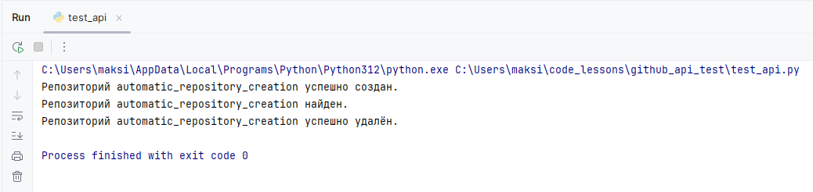

# GitHub API Test

## Описание
Этот проект создаёт, проверяет и удаляет репозиторий на GitHub с помощью GitHub API.




## Установка и настройка

### 1. Клонируйте репозиторий:

```bash
git clone https://github.com/QuadDarv1ne/github_api_test.git
cd github_api_test
```

#### Структура проекта:
```
github_api_test/
│
├── img/
│   ├── github_repo.png
│   └── github_api_test.png
│
├── test_api.py            # Основной скрипт
├── .env_sample            # Файл с переменными окружения (.env)
├── .gitignore
├── requirements.txt       # Зависимости
└── README.md              # Инструкция по установке и запуску
```

### 2. Установка необходимых зависимостей

```bash
pip install -r requirements.txt
```

### 3. Запуск проекта

```bash
python test_api.py
```

Этот проект предоставляет воспроизводимый тест, который можно запустить на любом компьютере.


**Автор:** © Дуплей Максим Игоревич

**Дата:** 12.09.2024

**Версия 1.0**